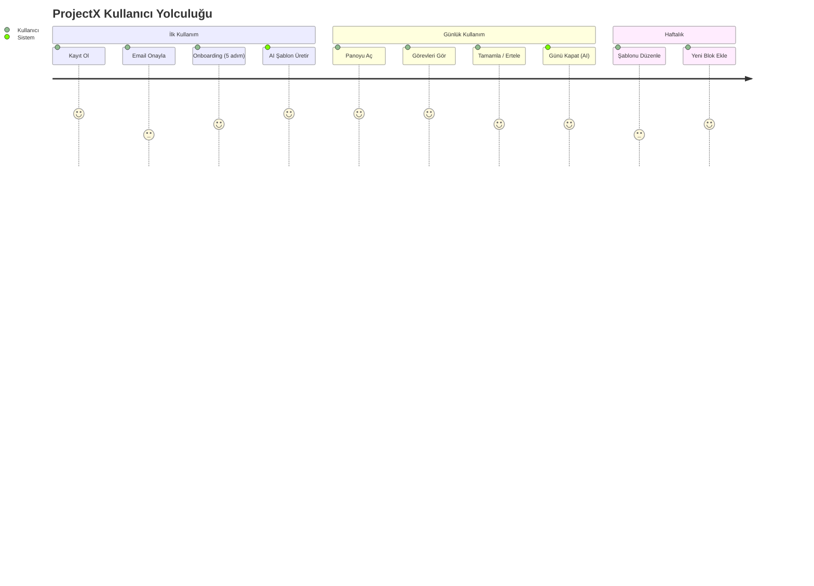

# 🎯 Proje Vizyonu

← [[00 - 🧠 Ana Hub]] | → [[02 - 🏗️ Mimari]]

---

## 🌟 Ne Yapar?

> [!quote] Temel Fikir
> İnsanlar sabah mı, öğleden sonra mı, akşam mı daha verimli? Bunu bilen bir sistem, görevleri doğru zamana yerleştirir. Değiştiremeyen randevuları (ders, toplantı) kilitler, geri kalanı akıllıca yeniden planlar.

ProjectX, kullanıcının **biyolojik ritmine** ve **hayat kısıtlamalarına** uygun bir haftalık çerçeve (skeleton) oluşturur, ardından bunu günlük görevlere dönüştürür.

---

## 👤 Hedef Kullanıcı

```
Kim? → Öğrenci veya çalışan, Türkçe konuşan
Sorunu? → Zaman yönetimi yapamıyor, enerji düşünce görevler yarım kalıyor
Ne istiyor? → "Sadece bana bugün ne yapacağımı söyle"
```

> [!example] Tipik Kullanıcı Senaryosu
> Ahmet, sabahları en verimli. Haftanın 3 günü 9-17 arası işi var (hard constraint).
> ProjectX onun enerji profilini alır, AI bir haftalık iskelet üretir.
> Her sabah Ahmet panoyu açar, görevlerini görür. Bitiremediği şeyi → sistem ertesi gün uygun slota taşır.

---

## 💎 Değer Önerisi

| Rakip Yaklaşım | ProjectX Farkı |
|----------------|----------------|
| Manuel takvim | AI ile otomatik şablon |
| Genel görev listesi | Enerji döngüsüne uygun zamanlama |
| Statik plan | Kaçırılan görevleri akıllıca taşı |
| Motivasyon push | Mekanik + sade refleksiyon |

---

## 🔑 Temel Kavramlar

### 1. Skeleton Block (İskelet Blok)
```
Bir haftalık şablonun tekrarlayan zaman dilimleri.
Örnek: Her Pazartesi 09:00-10:00 "Derin Çalışma"
```

> [!info] Skeleton Block Özellikleri
> - **Hard Constraint** → Hareket ettirilemez (ders, toplantı)
> - **Energy Cost** → 1 (hafif) - 5 (çok yorucu)
> - **Flexibility Score** → 1 (katı) - 5 (esnek)

### 2. Task (Görev)
```
Skeleton Block'tan her gün üretilen somut görev kopyası.
Skeleton: her gün için bir instance oluşturur.
```

### 3. Energy Peak (Enerji Zirvesi)
```
Kullanıcının en verimli olduğu zaman dilimleri.
Sabah / Öğleden Sonra / Akşam → Yüksek / Orta / Düşük
```

### 4. AI Reflection (AI Refleksiyonu)
```
Günün sonunda: "Bugün X görev tamamlandı, Y görev ertelendi."
Sade, mekanik, motivasyon jargonu yok.
```

---

## 🗓️ Kullanıcı Yolculuğu



---

## 🚫 Kapsam Dışı (Şu An)

> [!warning] Yapılmayacaklar
> - Push bildirimleri
> - Takvim entegrasyonu (Google/Apple)
> - Ekip/paylaşım özellikleri
> - Mobil native uygulama
> - Çoklu dil

---

#projectx #vizyon #kullanici
