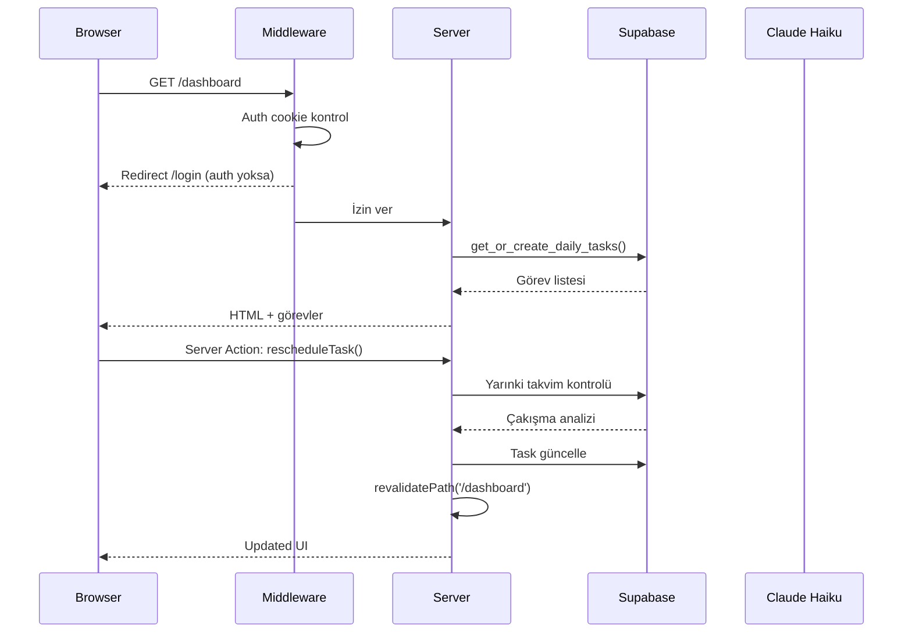
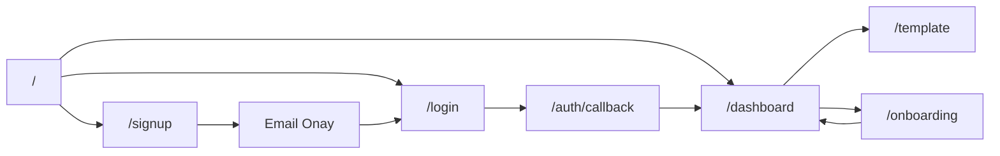

# 🏗️ Mimari

← [[01 - 🎯 Proje Vizyonu]] | → [[03 - 🗄️ Veritabanı]]

---

## 🛠️ Tech Stack

```
┌─────────────────────────────────────────────┐
│              FRONTEND                        │
│  Next.js 16 (App Router) + React 19         │
│  TypeScript 5 + Tailwind CSS 4              │
├─────────────────────────────────────────────┤
│              BACKEND                         │
│  Next.js Server Actions + API Routes        │
│  Supabase (PostgreSQL + Auth + RLS)         │
├─────────────────────────────────────────────┤
│              AI LAYER                        │
│  Anthropic Claude Haiku 4.5                 │
│  @ai-sdk/anthropic v3.0.71                  │
│  Vercel AI SDK (generateObject)             │
└─────────────────────────────────────────────┘
```

---

## 📦 Paketler

| Paket | Versiyon | Kullanım |
|-------|----------|---------|
| `next` | 16.2.4 | Framework |
| `react` | 19 | UI |
| `typescript` | 5 | Tip güvenliği |
| `tailwindcss` | 4 | Stil |
| `@supabase/supabase-js` | latest | DB + Auth |
| `@supabase/ssr` | latest | Server-side auth |
| `@ai-sdk/anthropic` | 3.0.71 | Claude API |
| `ai` (Vercel AI SDK) | latest | generateObject |
| `zod` | latest | Validasyon şeması |

---

## 🗂️ Klasör Yapısı

```
ProjectX/
├── src/
│   ├── app/
│   │   ├── page.tsx                    ← Kök → /dashboard yönlendir
│   │   ├── layout.tsx                  ← HTML kök, lang="tr"
│   │   ├── globals.css                 ← Tailwind + özel animasyonlar
│   │   │
│   │   ├── (auth)/                     ← Route grubu (layout yok)
│   │   │   ├── layout.tsx              ← Ortalanmış auth layout
│   │   │   ├── login/page.tsx
│   │   │   └── signup/page.tsx
│   │   │
│   │   ├── auth/
│   │   │   ├── callback/route.ts       ← Email doğrulama callback
│   │   │   └── signout/route.ts        ← Çıkış endpoint
│   │   │
│   │   ├── onboarding/
│   │   │   ├── page.tsx                ← Server wrapper
│   │   │   └── OnboardingForm.tsx      ← 5 adımlı form (446 satır)
│   │   │
│   │   ├── (dashboard)/                ← Route grubu (sidebar layout)
│   │   │   ├── layout.tsx              ← Sidebar navigasyon
│   │   │   ├── dashboard/
│   │   │   │   ├── page.tsx            ← Günlük görev görünümü
│   │   │   │   ├── TaskCard.tsx        ← Görev kartı + time-lock
│   │   │   │   ├── CloseDay.tsx        ← AI refleksiyonu tetikle
│   │   │   │   └── actions.ts          ← Görev server actions
│   │   │   └── template/
│   │   │       ├── page.tsx            ← Server-side yük
│   │   │       ├── TemplateManager.tsx ← CRUD + modal (726 satır)
│   │   │       └── actions.ts          ← Skeleton CRUD actions
│   │   │
│   │   └── api/
│   │       └── onboarding/route.ts     ← AI şablon üretimi (POST)
│   │
│   ├── lib/
│   │   └── supabase/
│   │       ├── client.ts               ← Browser Supabase client
│   │       ├── server.ts               ← Server Supabase client
│   │       └── middleware.ts           ← Auth middleware helper
│   │
│   └── types/
│       └── supabase.ts                 ← DB'den üretilen tipler
│
├── supabase/
│   ├── config.toml                     ← Supabase proje ayarları
│   └── migrations/                     ← 6 SQL migration
│       ├── 001_initial_schema.sql
│       ├── 002_add_rls.sql
│       ├── ...
│       └── 006_advisory_lock.sql
│
├── middleware.ts                        ← Next.js auth middleware
├── next.config.ts
├── tailwind.config.ts
└── tsconfig.json
```

---

## 🏛️ Mimari Kararlar

### Server Actions > REST API

> [!success] Neden Server Actions?
> - Type-safe mutation (Zod ile)
> - Otomatik revalidation (`revalidatePath`)
> - Formdan doğrudan çağrılabilir
> - Boilerplate yok
> 
> **Sadece** `api/onboarding` REST API — çünkü AI SDK streaming için POST endpoint gerekiyor.

### Optimistic UI

> [!info] useOptimistic Kullanımı
> `TaskCard.tsx` içinde `useOptimistic` hook'u ile:
> - Kullanıcı buton'a basınca UI anında güncellenir
> - Sunucu cevabı gelince gerçek state yerleşir
> - Hata olursa rollback

### Supabase RLS (Row Level Security)

> [!warning] Güvenlik Katmanı
> Her tablo için RLS aktif:
> ```sql
> USING (auth.uid() = user_id)
> ```
> Kullanıcılar sadece kendi verilerine erişebilir.
> API key client-side'da açık olsa bile güvenli.

### Advisory Lock (Race Condition Önleme)

> [!tip] PostgreSQL Advisory Lock
> `get_or_create_daily_tasks` RPC'si concurrent isteklerde
> aynı görevi iki kez oluşturmasın diye PostgreSQL advisory lock kullanıyor.

---

## 🔄 Request Yaşam Döngüsü



---

## 🌐 Route Yapısı



---

## ⚙️ Environment Variables

| Değişken | Yer | Açıklama |
|----------|-----|---------|
| `NEXT_PUBLIC_SUPABASE_URL` | Client+Server | Supabase proje URL |
| `NEXT_PUBLIC_SUPABASE_ANON_KEY` | Client+Server | Public anon key |
| `ANTHROPIC_API_KEY` | Server only | Claude API key |
| `NEXT_PUBLIC_DEV_BYPASS` | Dev only | Dev login bypass |
| `NEXT_PUBLIC_DEV_EMAIL` | Dev only | Test hesabı |
| `NEXT_PUBLIC_DEV_PASSWORD` | Dev only | Test şifresi |

---

#projectx #mimari #techstack
