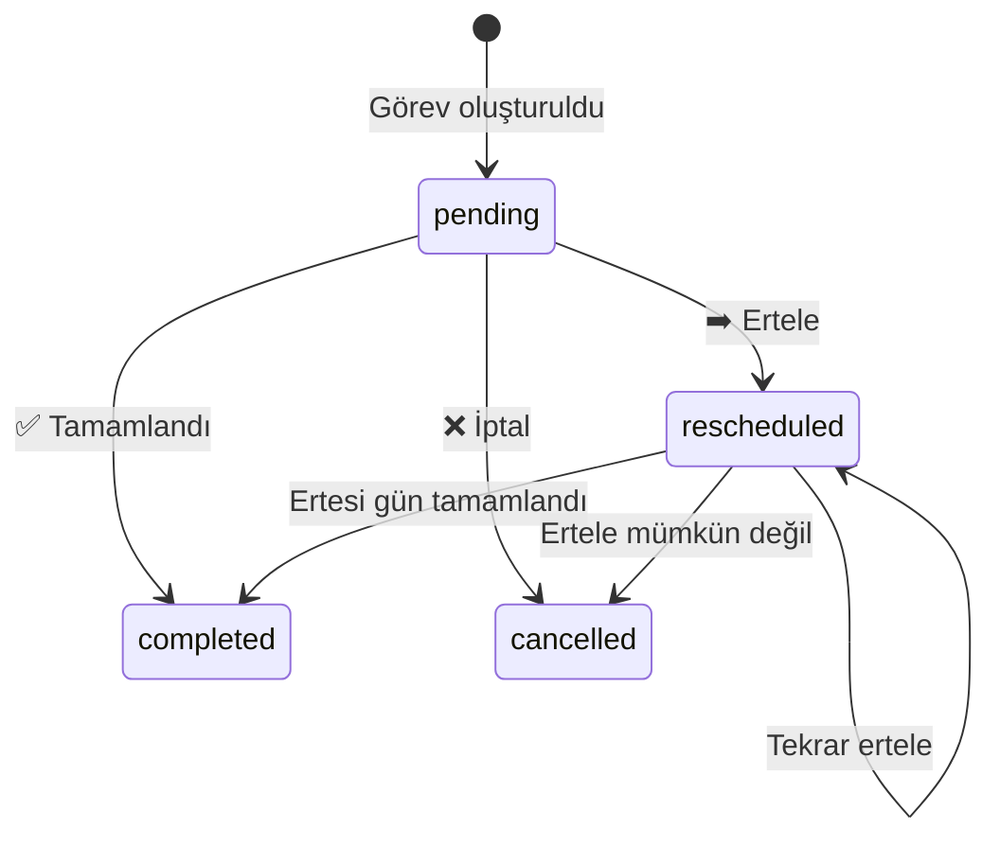

# 🗄️ Veritabanı

← [[02 - 🏗️ Mimari]] | → [[04 - 🔄 Kullanıcı Akışları]]

---

## 📊 Şema Genel Bakış

```mermaid
erDiagram
    AUTH_USERS {
        uuid id PK
        text email
    }
    PROFILES {
        uuid id PK_FK
        text full_name
        time wake_up_time
        time bed_time
        jsonb energy_peaks
        bool onboarding_completed
    }
    SKELETON_BLOCKS {
        uuid id PK
        uuid user_id FK
        int day_of_week
        time start_time
        time end_time
        text title
        bool is_hard_constraint
        int energy_cost
        int flexibility_score
    }
    TASKS {
        uuid id PK
        uuid user_id FK
        uuid skeleton_block_id FK
        text title
        text description
        date task_date
        date original_date
        time start_time
        time end_time
        int energy_cost
        int flexibility_score
        text status
    }
    DAILY_REFLECTIONS {
        uuid id PK
        uuid user_id FK
        date reflection_date
        text ai_message
    }

    AUTH_USERS ||--|| PROFILES : "1-1"
    AUTH_USERS ||--o{ SKELETON_BLOCKS : "1-N"
    AUTH_USERS ||--o{ TASKS : "1-N"
    AUTH_USERS ||--o{ DAILY_REFLECTIONS : "1-N"
    SKELETON_BLOCKS ||--o{ TASKS : "1-N"
```

---

## 🗃️ Tablo Detayları

### `profiles`

> [!info] Kullanıcı Profili
> Her kullanıcı için 1-1 ilişki. `auth.users` tablosunu extend eder.

| Kolon | Tip | Açıklama |
|-------|-----|---------|
| `id` | UUID | FK → auth.users.id |
| `full_name` | TEXT | Kullanıcı adı |
| `wake_up_time` | TIME | Sabah kalkış saati |
| `bed_time` | TIME | Uyku saati |
| `energy_peaks` | JSONB | `{morning, afternoon, evening}: 'high'|'medium'|'low'` |
| `onboarding_completed` | BOOLEAN | Onboarding tamamlandı mı? |

```json
// energy_peaks örneği
{
  "morning": "high",
  "afternoon": "medium",
  "evening": "low"
}
```

---

### `skeleton_blocks`

> [!info] Haftalık Şablon Blokları
> Kullanıcının tekrarlayan zaman dilimlerini tanımlar.
> AI onboarding sırasında bunları otomatik oluşturur.

| Kolon | Tip | Açıklama |
|-------|-----|---------|
| `id` | UUID | Primary key |
| `user_id` | UUID | FK → auth.users |
| `day_of_week` | INT | 0=Pazartesi, 6=Pazar |
| `start_time` | TIME | Başlangıç saati |
| `end_time` | TIME | Bitiş saati |
| `title` | TEXT | Blok adı |
| `is_hard_constraint` | BOOLEAN | Hareket ettirilemez mi? |
| `energy_cost` | INT | 1-5 (hafif → çok yorucu) |
| `flexibility_score` | INT | 1-5 (katı → esnek) |

> [!warning] İş Kuralı
> `is_hard_constraint = true` ise `flexibility_score` otomatik olarak **1** ayarlanır.
> Bu kural hem client UI'da hem sunucu tarafında uygulanır.

---

### `tasks`

> [!info] Günlük Görevler
> Her gün skeleton_blocks'tan üretilen somut görev kopyaları.

| Kolon | Tip | Açıklama |
|-------|-----|---------|
| `id` | UUID | Primary key |
| `user_id` | UUID | FK → auth.users |
| `skeleton_block_id` | UUID | FK → skeleton_blocks (nullable) |
| `title` | TEXT | Görev adı |
| `description` | TEXT | Açıklama (nullable) |
| `task_date` | DATE | Bu görevin tarihi |
| `original_date` | DATE | İlk oluşturulma tarihi (trigger ile set) |
| `start_time` | TIME | Başlangıç |
| `end_time` | TIME | Bitiş |
| `energy_cost` | INT | 1-5 |
| `flexibility_score` | INT | 1-5 |
| `status` | TEXT | `pending` / `completed` / `rescheduled` / `cancelled` |

#### Task Status Akışı



---

### `daily_reflections`

> [!info] AI Günlük Refleksiyonlar
> Günün sonu AI özeti. `(user_id, reflection_date)` unique kısıtı var.

| Kolon | Tip | Açıklama |
|-------|-----|---------|
| `id` | UUID | Primary key |
| `user_id` | UUID | FK → auth.users |
| `reflection_date` | DATE | Refleksiyonun tarihi |
| `ai_message` | TEXT | Claude'un ürettiği özet |

---

## 🔐 Row Level Security (RLS)

> [!success] Güvenlik Katmanı
> Tüm tablolarda RLS aktif. Her kullanıcı sadece kendi satırlarına erişebilir.

```sql
-- Örnek RLS policy (tüm tablolarda benzer)
CREATE POLICY "users_own_data" ON tasks
  FOR ALL
  USING (auth.uid() = user_id)
  WITH CHECK (auth.uid() = user_id);
```

---

## ⚙️ RPC Fonksiyonları

### `complete_onboarding(p_user_id, p_skeleton_blocks, p_profile_data)`

> [!tip] Onboarding Tamamlama
> AI'nın ürettiği skeleton blokları toplu olarak ekler ve profili günceller.
> Tek bir transaction içinde çalışır.

```
Parametre: p_skeleton_blocks → JSONB array (max 30 blok)
1. profiles tablosunu güncelle (wake_time, bed_time, energy_peaks, onboarding_completed=true)
2. skeleton_blocks tablosuna bulk insert
```

---

### `get_or_create_daily_tasks(p_user_id, p_date, p_day_of_week)`

> [!tip] Günlük Görev Oluşturma
> İdempotent: Aynı tarih için iki kez çağrılsa bile görevleri çift oluşturmaz.

```
1. PostgreSQL Advisory Lock al (race condition önle)
2. Bu tarih için görev var mı? kontrol et
3. Yoksa: o günün skeleton_blocks'larından task oluştur
4. Var ise: mevcut görevleri döndür
5. Lock bırak
```

---

### Trigger: `set_task_original_date`

> [!info] Otomatik Tetikleyici
> `tasks` tablosuna yeni satır INSERT edildiğinde `original_date = task_date` otomatik set edilir.
> Görev erteleninceErteleme sonrası `task_date` değişse bile `original_date` ilk değeri korur.

---

## 📈 Migration Geçmişi

| Migration | İçerik |
|-----------|--------|
| `001_initial_schema.sql` | Temel tablolar |
| `002_add_rls.sql` | RLS politikaları |
| `003_rpc_onboarding.sql` | complete_onboarding RPC |
| `004_rpc_daily_tasks.sql` | get_or_create_daily_tasks RPC |
| `005_original_date_trigger.sql` | set_task_original_date trigger |
| `006_advisory_lock.sql` | Race condition fix |

---

#projectx #veritabani #supabase #schema
