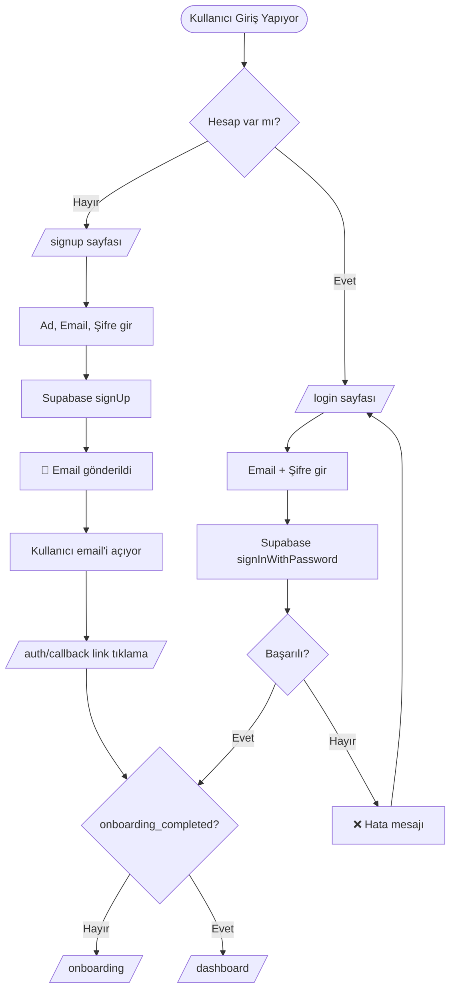
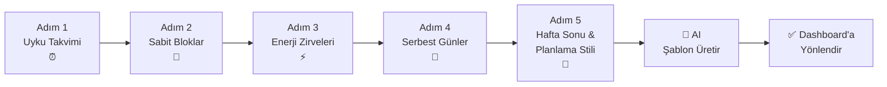
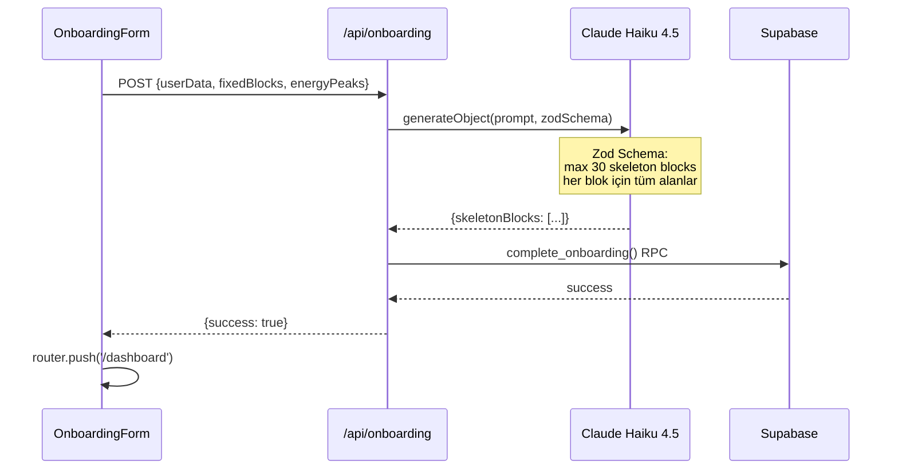
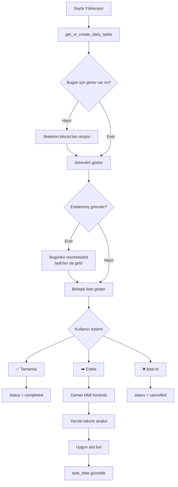
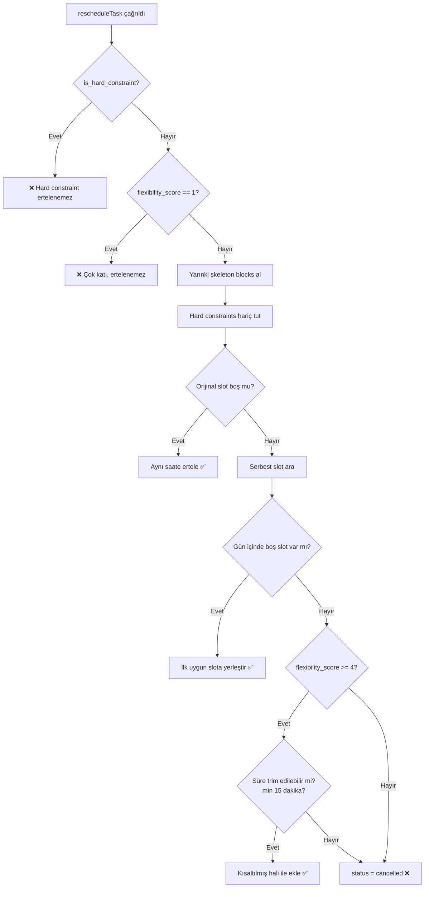
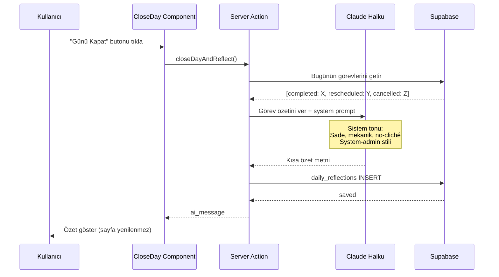

# 🔄 Kullanıcı Akışları

← [[03 - 🗄️ Veritabanı]] | → [[05 - 🧩 Bileşenler]]

---

## 1️⃣ Kimlik Doğrulama Akışı



> [!info] Middleware Rolü
> `middleware.ts` her request'te auth cookie'yi kontrol eder.
> - Dashboard sayfaları → auth zorunlu
> - Login/signup → auth varsa /dashboard'a yönlendir

---

## 2️⃣ Onboarding Akışı (5 Adım)



### Adım Detayları

#### Adım 1: Uyku Takvimi
```
- Hafta içi kalkış saati
- Hafta içi uyku saati  
- Hafta sonu kalkış saati
- Hafta sonu uyku saati
```

#### Adım 2: Sabit Haftalık Bloklar
```
Kullanıcı ekliyor:
- İş / Okul blokları
- Tekrarlayan toplantılar
- Düzenli aktiviteler
Her blok: Gün + Başlangıç + Bitiş + Ad
```

#### Adım 3: Enerji Zirveleri
```
Sabah (06:00-12:00)    → Yüksek / Orta / Düşük
Öğleden Sonra (12-18)  → Yüksek / Orta / Düşük
Akşam (18:00-22:00)    → Yüksek / Orta / Düşük
```

#### Adım 4: Serbest Günler
```
Hangi günler daha az yüklenilmeli?
Checkbox: Pazartesi - Salı - ... - Pazar
```

#### Adım 5: Hafta Sonu & Planlama Stili
```
Hafta sonu rutini: Aktif / Dinlendirici / Karışık
Planlama stili: Sıkı / Dengeli / Esnek
```

---

## 3️⃣ AI Şablon Üretimi



> [!tip] AI Prompt Stratejisi
> Claude'a verilen bilgiler:
> - Kullanıcının enerji profili
> - Sabit bloklar (bunlara dokunma!)
> - Uyku/uyanış saatleri
> - Boş zaman aralıkları
> 
> Claude çıktısı: Her gün için skeleton block array'i

---

## 4️⃣ Günlük Dashboard Akışı



---

## 5️⃣ Görev Yeniden Zamanlama Algoritması

> [!abstract] Yeniden Zamanlama Mantığı
> Bu sistemin en kritik iş mantığı. `actions.ts` içinde `rescheduleTask()`.



#### Algoritma Parametreleri
| Parametre | Değer | Açıklama |
|-----------|-------|---------|
| Minimum süre | 15 dakika | `MIN_DURATION = 15` |
| Yüksek esneklik eşiği | 4 | Trim için gerekli flexibility_score |
| Ertele süresi | +1 gün | Her zaman ertesi gün |

---

## 6️⃣ Close Day (Günü Kapat) Akışı



> [!note] AI Tonu
> System prompt özellikle belirtiliyor: **motivasyon klişesi yok**, mekanik rapor tonu.
> Örnek çıktı: *"3 görev tamamlandı. 'Derin Çalışma' yarına ertelendi. 1 görev iptal edildi."*

---

## ⏰ Time-Lock Özelliği

> [!warning] Zaman Kilidi
> Görev henüz başlamadıysa (start_time gelmediyse) butonlar devre dışı.
> Kullanıcı sabah 7'deki görevi gece yarısı tamamlayamaz.
> Istanbul timezone'a göre hesaplanır.

---

#projectx #kullanici-akislari #flows
