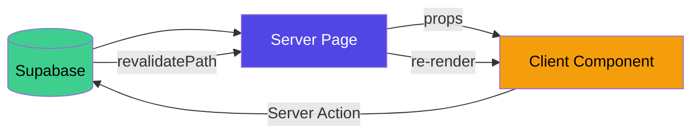

# 🧩 Bileşenler

← [[04 - 🔄 Kullanıcı Akışları]] | → [[06 - ⚡ Server Actions & API]]

---

## 🌳 Bileşen Ağacı

```
RootLayout (layout.tsx)
├── (auth)/layout.tsx — Ortalanmış auth wrapper
│   ├── LoginPage (login/page.tsx) [CLIENT]
│   └── SignUpPage (signup/page.tsx) [CLIENT]
│
├── OnboardingPage (onboarding/page.tsx) [SERVER]
│   └── OnboardingForm [CLIENT] ← 446 satır, 5 adım
│       ├── Adım göstergesi (1-5 progress)
│       ├── SleepScheduleStep
│       ├── FixedBlocksStep
│       ├── EnergyPeaksStep
│       ├── FreeDaysStep
│       └── WeekendRoutineStep
│
└── (dashboard)/layout.tsx [SERVER] — Sidebar nav
    ├── DashboardPage (dashboard/page.tsx) [SERVER]
    │   ├── TaskCard [CLIENT] × N ← 204 satır
    │   │   ├── Görev bilgisi
    │   │   ├── Zaman kilidi kontrolü
    │   │   └── Aksiyon butonları (✅ ➡️ ❌)
    │   └── CloseDay [CLIENT] ← 50 satır
    │       └── AI refleksiyon paneli
    │
    └── TemplatePage (template/page.tsx) [SERVER]
        └── TemplateManager [CLIENT] ← 726 satır
            ├── Gün sekmesi (Pazartesi-Pazar)
            ├── BlockCard × N
            │   ├── Blok başlığı + zaman
            │   ├── Energy/Flexibility göstergesi
            │   └── Düzenle/Sil butonları
            └── BlockModal (oluştur/düzenle)
                ├── Form alanları
                ├── ScoreButtons (energy + flexibility)
                └── ToggleSwitch (hard constraint)
```

---

## 📋 Bileşen Detayları

### `OnboardingForm` — `src/app/onboarding/OnboardingForm.tsx`

> [!info] 446 satır | CLIENT bileşen

**State Yapısı:**
```typescript
{
  currentStep: 1-5,
  sleepSchedule: {
    weekday: { wake: string, sleep: string },
    weekend: { wake: string, sleep: string }
  },
  fixedBlocks: Array<{
    day: number, startTime: string, endTime: string, title: string
  }>,
  energyPeaks: {
    morning: 'high'|'medium'|'low',
    afternoon: 'high'|'medium'|'low',
    evening: 'high'|'medium'|'low'
  },
  freeDays: number[],
  weekendRoutine: 'active'|'restful'|'mixed',
  planningStyle: 'strict'|'balanced'|'flexible'
}
```

**Adım geçiş animasyonu:** `fade-up` CSS keyframe animasyonu

---

### `TaskCard` — `src/app/(dashboard)/dashboard/TaskCard.tsx`

> [!info] 204 satır | CLIENT bileşen | `useOptimistic` kullanıyor

**Props:**
```typescript
{
  task: Task,
  isHardConstraint: boolean
}
```

**Özellikler:**
| Özellik | Açıklama |
|---------|---------|
| Time-lock | `start_time` gelmeden önce butonlar disabled |
| Optimistic UI | `useOptimistic` ile anında feedback |
| Status badge | pending/completed/rescheduled/cancelled renk kodlu |
| Energy badge | 1-5 renk gradyanı (yeşil→kırmızı) |

**Aksiyon Butonları:**
- ✅ Yeşil `+` → `updateTaskStatus('completed')`
- ➡️ Amber `→` → `rescheduleTask()`
- ❌ Kırmızı `×` → `updateTaskStatus('cancelled')`

---

### `CloseDay` — `src/app/(dashboard)/dashboard/CloseDay.tsx`

> [!info] 50 satır | CLIENT bileşen

**İki Durum:**
1. Refleksiyon yoksa → "Günü Kapat" butonu
2. Refleksiyon varsa → AI mesajı göster (readonly)

**Sayfa yenileme gerektirmez** — server action'dan gelen mesaj direkt state'e yazılır.

---

### `TemplateManager` — `src/app/(dashboard)/template/TemplateManager.tsx`

> [!info] 726 satır | CLIENT bileşen | En büyük bileşen

**İçerik:**
- 7 günlük sekme (Pazartesi → Pazar)
- Her gün için skeleton block listesi
- Yeni blok ekle butonu
- Sil + Düzenle aksiyonları
- `BlockModal`: oluştur/düzenle formu

**Modal State:**
```typescript
{
  isOpen: boolean,
  mode: 'create' | 'edit',
  editingBlock: SkeletonBlock | null,
  selectedDay: number
}
```

---

### `ScoreButtons` — TemplateManager içinde

> [!tip] Alt Bileşen

5 düğmeli puan seçici. Energy Cost ve Flexibility Score için kullanılıyor.

```
[1] [2] [3] [4] [5]
 Hafif           Ağır
```

Aktif butonu highlight. Yayın özelliği: hard constraint seçilince flexibility 1'e kilitlenir.

---

### `ToggleSwitch` — TemplateManager içinde

> [!tip] Alt Bileşen

Hard constraint toggle. `is_hard_constraint` alanını yönetir.
Toggle açıksa: `flexibility_score` otomatik olarak 1'e set edilir, puan butonları devre dışı kalır.

---

### Layout Bileşenleri

#### `(dashboard)/layout.tsx`

```
Sidebar Navigasyon:
├── 🏠 Bugün → /dashboard
├── 📅 Haftalık Şablon → /template
└── ✓  Görevler → (gelecek?)

Sağ taraf: page content
```

#### `(auth)/layout.tsx`

Sayfayı dikey/yatay ortalar. Basit wrapper.

---

## 🔄 Data Flow (Bileşen Perspektifinden)



> [!success] Pattern
> Server bileşeni veriyi çeker → Client bileşenine props olarak geçer → 
> Client Server Action çağırır → Path revalidate olur → Server yeniden render

---

## 🎭 Client vs Server Dağılımı

| Bileşen | Tip | Neden? |
|---------|-----|--------|
| `layout.tsx` (root) | Server | Statik HTML yapısı |
| `login/page.tsx` | Client | Form state, event handlers |
| `signup/page.tsx` | Client | Form state |
| `onboarding/page.tsx` | Server | Auth redirect kontrolü |
| `OnboardingForm` | Client | Çok adımlı form state |
| `dashboard/page.tsx` | Server | İlk veri yükü |
| `TaskCard` | Client | Optimistic UI, event handlers |
| `CloseDay` | Client | Async AI call state |
| `template/page.tsx` | Server | İlk veri yükü |
| `TemplateManager` | Client | CRUD modal state |

---

#projectx #bilesенler #react #components
