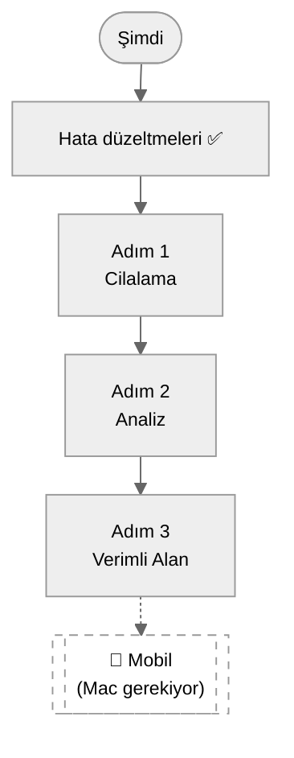
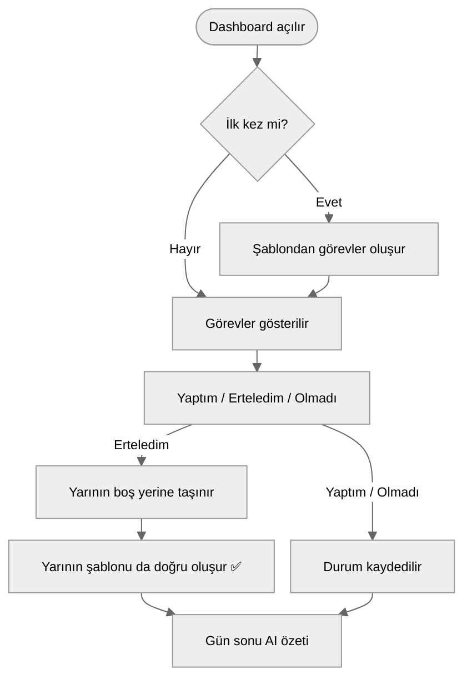
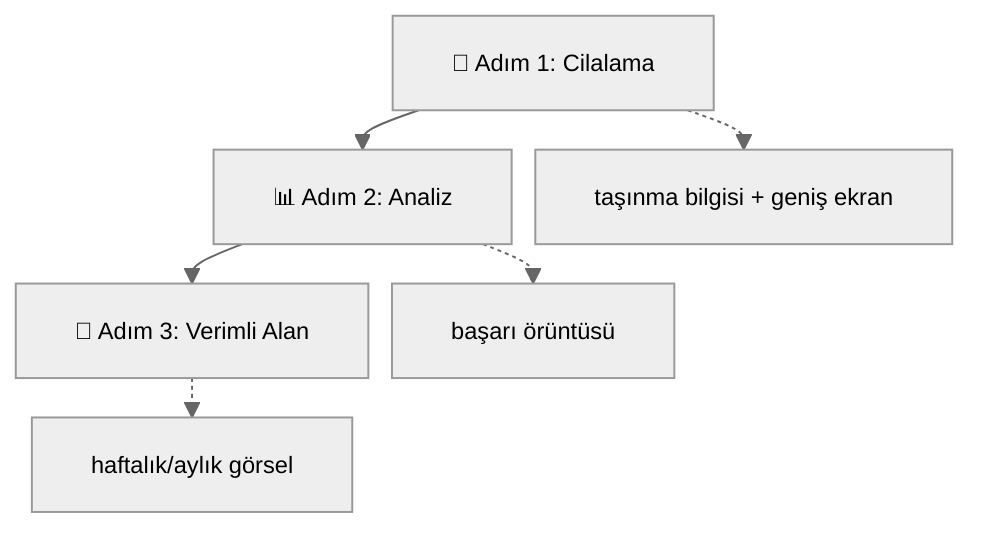

# 🚦 Şu An Neredeyiz (Web Dönemi)

> [!note] Bu dosya hakkında
> Bu not, 2026-08-13 tarihli bir Claude Code oturumunda otomatik oluşturuldu — senin elle yazdığın 00-09 notlarından farklı olarak istediğin gibi düzenleyebilir ya da silebilirsin. Amacı: mobil/bildirim işi ertelendikten sonra "şu an ne durumdayız, sırada ne var" sorusuna tek bakışta cevap vermek. Detaylı mimari için [[03 - 🗄️ Veritabanı]] ve [[04 - 🔄 Kullanıcı Akışları]]'na bak.

---

## 1️⃣ Neden sadece web?

Mobil (iOS) uygulama, bildirim-merkezli vizyonun çekirdeğiydi ama iOS geliştirmek için **Mac + Xcode** ve **Apple Developer Program üyeliği** (yıllık ~$99) şart. Şu an elimizde sadece bir Windows PC ve bir iPhone var (geliştirme ortamı olarak değil, test cihazı olarak). Bu yüzden:

Mobil tamamen iptal olmadı, sadece rafa kalktı — Mac/hesap edinilince buraya geri dönülecek.

---

## 2️⃣ Mevcut akış (bugünkü hata düzeltmelerinden sonra)

> [!info] Bugün düzeltilen hata
> Daha önce bir görevi ertelemek, taşındığı günün TÜM normal programını sessizce siliyordu (o günün şablonu hiç oluşmuyordu). Artık düzeltildi ve gerçek veriyle test edildi.

---

## 3️⃣ Hedef akış (3 adım tamamlandıktan sonra)

---

## 4️⃣ Sıradaki adım

**Adım 1 — Cilalama** onayını bekliyor. Onaylanınca: `TaskCard.tsx`'e taşınma bilgisi eklenir, `layout.tsx` geniş ekrana göre düzenlenir.
